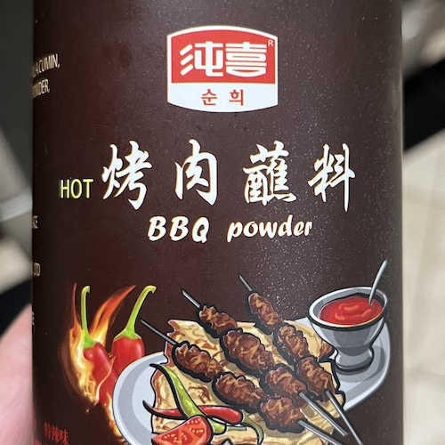

靈魂撒料：

以防停產，記錄一下撒料個配料：辣椒粉，芝麻，紫蘇，孜然，花生，味精，鹽，黃豆粉，洋蔥粉，白砂糖。

## 蝦
1. 簽子穿好，擦乾水
2. 烤乾，刷油，撒調料
3. 小火慢烤至不透明

## 烤魚
1. 魚從背部切開，改刀
2. 蔥一根，薑一小塊，花椒2g，八角2個，鹽25g，生抽15g，水800g，魚隔夜浸泡醃製
3. 烤魚夾子夾好
4. 小火慢烤至表皮酥脆

## 羊排
1. costco羊排切開
2. 肉重12%的洋蔥，3%的撒料，冰箱隔夜醃製
3. 小火慢烤至內部溫度到63度

## 牛肉串
1. 牛肉切成粒
2. 肉重10%的洋蔥，3%的撒料，1%的糖，1%的胡椒粉，1%的生抽，1%的鹽，16%的水，打成糊，冰箱隔夜醃製
3. 甜椒切塊與牛肉同串
4. 小火慢烤至內部溫度到63度

## 金針菇粉絲
1. 粉絲泡發，與金針菇，蒜茸置錫紙上烤熟

## 五花肉，年糕
1. 五花肉切片置於錫紙上慢火烤至金黃
2. 五花肉取出放鹽和撒料
3. 錫紙上放年糕烤至酥脆

## 雞翅
1. 奧爾良雞翅醃料說明醃製
2. 小火慢烤至內部溫度到74度

## 烤鱿鱼
1. 撒料加油配成酱料
2. 鱿鱼切块/整条剪好，刷酱
3. 烤箱200度烤五分钟
4. 拿出来翻面刷酱，再烤5分钟
5. 拿出来翻面刷酱，再烤3分钟
6. 拿出来翻面刷酱，再烤3分钟

---

## 參考
1. 賴皮猴愛美食 https://youtu.be/u8fBaEHkLy4

    肉部分：肥瘦相间牛肉500g 、羊排或羊腿肉500g。

    牛肉腌料部分：洋葱丝50g、孜然粉5g、十三香1g、白糖4g、白胡椒粉5g、 蒜粉5g、生抽5g、盐6g、鸡精4g、小苏打0.5g、黄豆粉20g、水80g

    羊肉腌料部分： 洋葱丝60g、一个蛋清、蚝油10g、盐6g

    肉串撒料部份：半颗粒然50g、芝麻10g、秘制鲜香小料10g

    秘制鲜香料部分： 鸡精100g、 味精30g、陈有香肉香粉5g、四宝浓缩鲜香粉5g、 十三香1g

2. 小高姐 烤魚 https://youtu.be/3GeG8wzJXdU